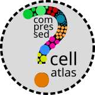

# Compressed cell atlas across organs and organisms
This web application demonstrates the idea of a "compressed cell atlas", i.e. a nonredundant distillation of one or more single cell omics data sets, across organs and organisms.

## Testing
### Virtualenv
To test the web application locally inside a Python virtualenv:

1. make sure you compress the atlases appriopriately or ask Fabio for the compressed files
2. open a terminal on linux/OSX and navigate to the `webapp` subfolder
3. run `./test.sh`

### Docker
To test locally inside a docker container (simulating lightsail virtualization):

1. Test locally as above
2. Start your docker service (e.g. `systemctl start docker`): you probably need superuser rights. If you started it already, you can skip this step.
3. Build (or rebuild) the docker container: `docker build -t compressed-atlas .`
4. Test the image: `docker run -p 5000:5000 compressed-atlas`. In this example it will run the image on port 5000.

## Functionality
Things you can do are shown on the home page once you launch the app, but as a quick (nonexhaustive) summary:
- Natural language processing: write your request and the app will answer
- Show gene expression and chromatin accessibility by cell type
- Show gene expression and chromatin accessibility for a single gene/region across ages in all cell types
- Show gene expression and chromatin accessibility for multiple genes/regions across ages in one cell type
- Show marker genes/chromatin regions for cell types
- Differential expression/accessibility across cell types, time points, organisms, and organs (WIP)
- Show relative cell type abundance
- Pathway analysis (Gene Ontology and KEGG)
- Look up gene information (GeneCards, JAX)
- Look up UCSC genome browser for gene/chromatin region coordinates
- Look up GO categories for each gene 
- Find genes/regions with similar expression/accessibility
- Find genes/regions that are closeby on the same chromosome/scaffold
- Suggest similar genes/chromatin peaks
- Download plots in PNG and SVG format, and plot data as CSV
- RESTful API access to the compressed data (documentation WIP)

**NOTE:** raw (uncompressed) data cannot be accessed directly.

## Architecture
The architecture of the compressed atlas is the following:
- A RESTful APIs to request the compressed data (e.g. `/data/gene_names=Col1a1`). Documentation for this API is WIP.
- A set of interative plots (mostly heatmaps or variations on the theme, e.g. dot plots) to visuaise the compressed data.
- A text control system enabling a natural language UX.

At this time, this application is pre-alpha, so the API changes all the time. If you are interested in how it works, write me an email at fabio _DOT_ zanini _AT_ unsw _DOT_ edu _DOT_ au.
